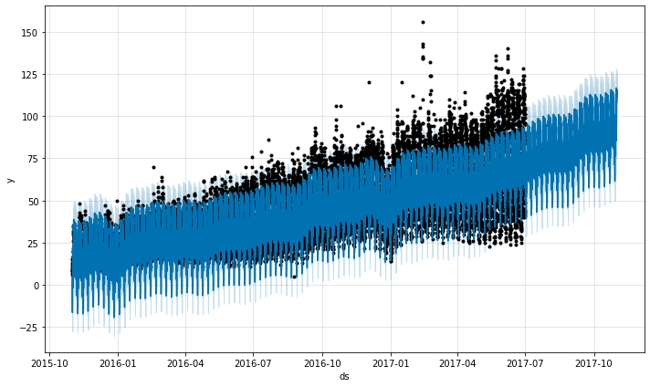
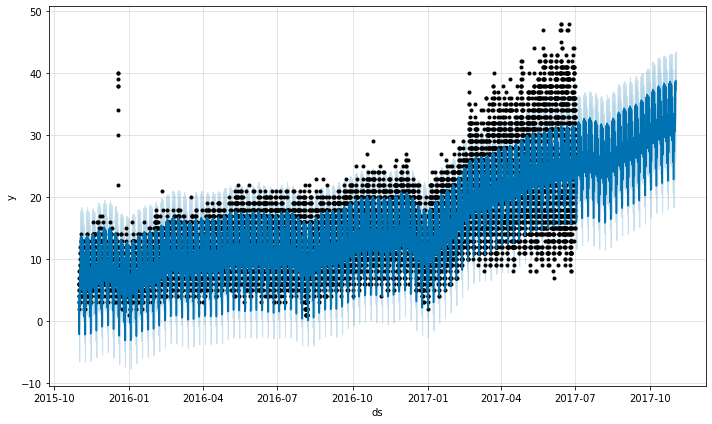
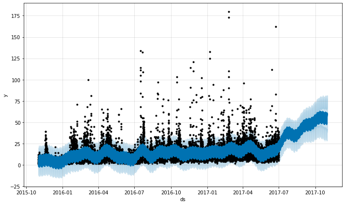
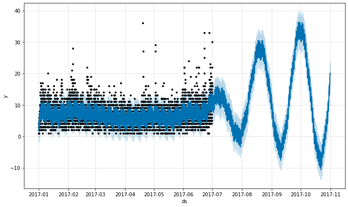

```python
import pandas as pd
import numpy as np
import datetime # manipulating date formats
# Viz
import matplotlib.pyplot as plt # basic plotting
import seaborn as sns # for prettier plots
# Settings
import warnings
warnings.filterwarnings("ignore")
```


```python
# TIME SERIES
from statsmodels.tsa.arima_model import ARIMA
from statsmodels.tsa.statespace.sarimax import SARIMAX
from pandas.plotting import autocorrelation_plot
from statsmodels.tsa.stattools import adfuller, acf, pacf,arma_order_select_ic
import statsmodels.formula.api as smf
import statsmodels.tsa.api as smt
import statsmodels.api as sm
import scipy.stats as scs
```

## Load Dataset


```python
df = pd.read_csv("C:\\Users\\Sameeksha Aithal\\Google Drive\\Practice\\Datasets\\IoT\\train_aWnotuB.csv")
```


```python
final = pd.read_csv("C:\\Users\\Sameeksha Aithal\\Google Drive\\Practice\\Datasets\\IoT\\test_BdBKkAj_L87Nc3S.csv")
```

## Basic Data Checks


```python
df.head()
```


<div>
<style scoped>
    .dataframe tbody tr th:only-of-type {
        vertical-align: middle;
    }

    .dataframe tbody tr th {
        vertical-align: top;
    }

    .dataframe thead th {
        text-align: right;
    }
</style>
<table border="1" class="dataframe">
  <thead>
    <tr style="text-align: right;">
      <th></th>
      <th>DateTime</th>
      <th>Junction</th>
      <th>Vehicles</th>
      <th>ID</th>
    </tr>
  </thead>
  <tbody>
    <tr>
      <td>0</td>
      <td>2015-11-01 00:00:00</td>
      <td>1</td>
      <td>15</td>
      <td>20151101001</td>
    </tr>
    <tr>
      <td>1</td>
      <td>2015-11-01 01:00:00</td>
      <td>1</td>
      <td>13</td>
      <td>20151101011</td>
    </tr>
    <tr>
      <td>2</td>
      <td>2015-11-01 02:00:00</td>
      <td>1</td>
      <td>10</td>
      <td>20151101021</td>
    </tr>
    <tr>
      <td>3</td>
      <td>2015-11-01 03:00:00</td>
      <td>1</td>
      <td>7</td>
      <td>20151101031</td>
    </tr>
    <tr>
      <td>4</td>
      <td>2015-11-01 04:00:00</td>
      <td>1</td>
      <td>9</td>
      <td>20151101041</td>
    </tr>
  </tbody>
</table>
</div>


```python
df.isnull().sum()
```


    DateTime    0
    Junction    0
    Vehicles    0
    ID          0
    dtype: int64


```python
df.shape
```


    (48120, 4)


```python
df.describe()
```


<div>
<style scoped>
    .dataframe tbody tr th:only-of-type {
        vertical-align: middle;
    }

    .dataframe tbody tr th {
        vertical-align: top;
    }

    .dataframe thead th {
        text-align: right;
    }
</style>
<table border="1" class="dataframe">
  <thead>
    <tr style="text-align: right;">
      <th></th>
      <th>Junction</th>
      <th>Vehicles</th>
      <th>ID</th>
    </tr>
  </thead>
  <tbody>
    <tr>
      <td>count</td>
      <td>48120.000000</td>
      <td>48120.000000</td>
      <td>4.812000e+04</td>
    </tr>
    <tr>
      <td>mean</td>
      <td>2.180549</td>
      <td>22.791334</td>
      <td>2.016330e+10</td>
    </tr>
    <tr>
      <td>std</td>
      <td>0.966955</td>
      <td>20.750063</td>
      <td>5.944854e+06</td>
    </tr>
    <tr>
      <td>min</td>
      <td>1.000000</td>
      <td>1.000000</td>
      <td>2.015110e+10</td>
    </tr>
    <tr>
      <td>25%</td>
      <td>1.000000</td>
      <td>9.000000</td>
      <td>2.016042e+10</td>
    </tr>
    <tr>
      <td>50%</td>
      <td>2.000000</td>
      <td>15.000000</td>
      <td>2.016093e+10</td>
    </tr>
    <tr>
      <td>75%</td>
      <td>3.000000</td>
      <td>29.000000</td>
      <td>2.017023e+10</td>
    </tr>
    <tr>
      <td>max</td>
      <td>4.000000</td>
      <td>180.000000</td>
      <td>2.017063e+10</td>
    </tr>
  </tbody>
</table>
</div>


```python
print(df.info())
```

    <class 'pandas.core.frame.DataFrame'>
    RangeIndex: 48120 entries, 0 to 48119
    Data columns (total 4 columns):
    DateTime    48120 non-null object
    Junction    48120 non-null int64
    Vehicles    48120 non-null int64
    ID          48120 non-null int64
    dtypes: int64(3), object(1)
    memory usage: 1.5+ MB
    None
    

We forecast the values for each Junctions separately.

## Prophet

### Junction 1

We divide the ts data into train and test. We try two approaches:

1. We determine the RMSE to understand our model performance. We use default hyperparameters here.
2. We then tune hyperparameters to get the lowest RMSE value. We use ParameterGrid for this.


```python
ts = df[df['Junction']==1][["DateTime", "Vehicles"]].reset_index(drop=True)
ts.columns=['ds','y']
```

We split the data into train and test. We use variable `n` to indicate the split


```python
n = int(round(ts.shape[0] * 0.7,0))
```

Here we create the train set


```python
train = ts[0:n]
```


```python
train['cap'] = 8.5
```

We now create the validation set


```python
valid=ts[n:].reset_index(drop = True)
```


```python
from fbprophet import Prophet
```

    Importing plotly failed. Interactive plots will not work.
    

#### We first try using default hyperparameters


```python
model = Prophet(yearly_seasonality=True)
model.fit(train) #fit the model with your dataframe
```


    <fbprophet.forecaster.Prophet at 0x25c9fa7c4a8>


```python
# 2952
# predict for five months in the furure and MS - month start is the frequency
future = model.make_future_dataframe(periods = valid.shape[0], freq = 'H')  
# now lets make the forecasts
forecast = model.predict(future)
#forecast[['ds', 'yhat', 'yhat_lower', 'yhat_upper']].tail(10)
res = forecast[['ds', 'yhat']][n:].reset_index(drop=True)
```

We now calculate RMSE


```python
np.sqrt((((res['yhat'] - valid['y'])*(res['yhat'] - valid['y'])).sum())/res.shape[0])
```


    25.960451882443632


#### We use ParameterGrid to identify optimal parameters.


```python
from sklearn.model_selection import ParameterGrid
params_grid = {'growth':('linear', 'logistic'),
               'changepoint_prior_scale':[0.3, 0.7],
              "yearly_seasonality":[True]}
grid = ParameterGrid(params_grid)
print([p for p in grid])
```

    [{'changepoint_prior_scale': 0.3, 'growth': 'linear', 'yearly_seasonality': True}, {'changepoint_prior_scale': 0.3, 'growth': 'logistic', 'yearly_seasonality': True}, {'changepoint_prior_scale': 0.7, 'growth': 'linear', 'yearly_seasonality': True}, {'changepoint_prior_scale': 0.7, 'growth': 'logistic', 'yearly_seasonality': True}]
    


```python
rmse = []
for p in grid:
    m =Prophet(**p)
    m.fit(train)
    #do scoring or diag
    #save p and score
    
    future = m.make_future_dataframe(periods = valid.shape[0], freq = 'H')  
    # now lets make the forecasts
    future['cap'] = 8.5
    forecast = m.predict(future)
    #forecast[['ds', 'yhat', 'yhat_lower', 'yhat_upper']].tail(10)
    res = forecast[['ds', 'yhat']][n:].reset_index(drop=True)
    rmse.append(np.sqrt((((res['yhat'] - valid['y'])*(res['yhat'] - valid['y'])).sum())/res.shape[0]))
```


```python
rmse
```


    [60.50490530380537, 65.53622848183991, 69.85819532635179, 65.53606214238]


Default hyperparameters: RMSE = 25.960451882443632

ParameterGrid hyperparameter tuning: lowest RMSE = 60.50490530380537

Thus, we don't use hyperparameters from ParameterGrid and use the default hyperparameters.

Implementing on full ts


```python
model = Prophet(yearly_seasonality=True)
model.fit(ts) #fit the model with your dataframe
```


    <fbprophet.forecaster.Prophet at 0x25ca1af9a20>


```python
future = model.make_future_dataframe(periods = 2952, freq = 'H')  
forecast = model.predict(future)
forecast[['ds', 'yhat', 'yhat_lower', 'yhat_upper']].tail()
```


<div>
<style scoped>
    .dataframe tbody tr th:only-of-type {
        vertical-align: middle;
    }

    .dataframe tbody tr th {
        vertical-align: top;
    }

    .dataframe thead th {
        text-align: right;
    }
</style>
<table border="1" class="dataframe">
  <thead>
    <tr style="text-align: right;">
      <th></th>
      <th>ds</th>
      <th>yhat</th>
      <th>yhat_lower</th>
      <th>yhat_upper</th>
    </tr>
  </thead>
  <tbody>
    <tr>
      <td>17539</td>
      <td>2017-10-31 19:00:00</td>
      <td>115.699891</td>
      <td>104.941110</td>
      <td>127.010440</td>
    </tr>
    <tr>
      <td>17540</td>
      <td>2017-10-31 20:00:00</td>
      <td>115.384532</td>
      <td>104.545083</td>
      <td>125.493431</td>
    </tr>
    <tr>
      <td>17541</td>
      <td>2017-10-31 21:00:00</td>
      <td>113.976584</td>
      <td>102.431467</td>
      <td>124.499871</td>
    </tr>
    <tr>
      <td>17542</td>
      <td>2017-10-31 22:00:00</td>
      <td>111.604422</td>
      <td>99.669968</td>
      <td>121.826411</td>
    </tr>
    <tr>
      <td>17543</td>
      <td>2017-10-31 23:00:00</td>
      <td>108.100970</td>
      <td>96.764068</td>
      <td>119.996823</td>
    </tr>
  </tbody>
</table>
</div>


```python
model.plot(forecast)
```





```python
d1 = pd.DataFrame(final[final['Junction']==1]['ID'])
```


```python
d2 = pd.DataFrame(forecast['yhat'][14592:].reset_index(drop=True))
d2 = d2.astype('int32')
```


```python
d = d1.join(d2, how = "outer")
```


```python
d.columns = ['Id', 'Vehicles']
```


```python
d.head()
```


<div>
<style scoped>
    .dataframe tbody tr th:only-of-type {
        vertical-align: middle;
    }

    .dataframe tbody tr th {
        vertical-align: top;
    }

    .dataframe thead th {
        text-align: right;
    }
</style>
<table border="1" class="dataframe">
  <thead>
    <tr style="text-align: right;">
      <th></th>
      <th>Id</th>
      <th>Vehicles</th>
    </tr>
  </thead>
  <tbody>
    <tr>
      <td>0</td>
      <td>20170701001</td>
      <td>72</td>
    </tr>
    <tr>
      <td>1</td>
      <td>20170701011</td>
      <td>66</td>
    </tr>
    <tr>
      <td>2</td>
      <td>20170701021</td>
      <td>60</td>
    </tr>
    <tr>
      <td>3</td>
      <td>20170701031</td>
      <td>55</td>
    </tr>
    <tr>
      <td>4</td>
      <td>20170701041</td>
      <td>51</td>
    </tr>
  </tbody>
</table>
</div>


We use default hyperparameters for the other 3 junctions as well.

## Junction 2


```python
ts = df[df['Junction']==2][["DateTime", "Vehicles"]].reset_index(drop=True)
ts.columns=['ds','y']
```

Implementing on full ts


```python
model = Prophet(yearly_seasonality=True) 
model.fit(ts) #fit the model with your dataframe
```


    <fbprophet.forecaster.Prophet at 0x25c9da059b0>


```python
future = model.make_future_dataframe(periods = 2952, freq = 'H')  
forecast = model.predict(future)
forecast[['ds', 'yhat', 'yhat_lower', 'yhat_upper']].tail()
```


<div>
<style scoped>
    .dataframe tbody tr th:only-of-type {
        vertical-align: middle;
    }

    .dataframe tbody tr th {
        vertical-align: top;
    }

    .dataframe thead th {
        text-align: right;
    }
</style>
<table border="1" class="dataframe">
  <thead>
    <tr style="text-align: right;">
      <th></th>
      <th>ds</th>
      <th>yhat</th>
      <th>yhat_lower</th>
      <th>yhat_upper</th>
    </tr>
  </thead>
  <tbody>
    <tr>
      <td>17539</td>
      <td>2017-10-31 19:00:00</td>
      <td>38.721201</td>
      <td>34.021979</td>
      <td>43.226263</td>
    </tr>
    <tr>
      <td>17540</td>
      <td>2017-10-31 20:00:00</td>
      <td>38.832351</td>
      <td>34.233365</td>
      <td>43.516146</td>
    </tr>
    <tr>
      <td>17541</td>
      <td>2017-10-31 21:00:00</td>
      <td>38.569878</td>
      <td>33.765169</td>
      <td>43.141750</td>
    </tr>
    <tr>
      <td>17542</td>
      <td>2017-10-31 22:00:00</td>
      <td>38.008113</td>
      <td>33.289247</td>
      <td>42.607825</td>
    </tr>
    <tr>
      <td>17543</td>
      <td>2017-10-31 23:00:00</td>
      <td>37.274329</td>
      <td>32.398319</td>
      <td>41.686709</td>
    </tr>
  </tbody>
</table>
</div>


```python
model.plot(forecast)
```





```python
d1 = pd.DataFrame(final[final['Junction']==2]['ID'])
```


```python
d1 = d1.reset_index(drop = True)
```


```python
d2 = pd.DataFrame(forecast['yhat'][14592:].reset_index(drop=True))
d2 = d2.astype('int32')
```


```python
temp = d1.join(d2, how = "outer")
```


```python
temp.columns = ['Id', 'Vehicles']
```


```python
d = d.append(temp).reset_index(drop = True)
```

## Junction 3


```python
ts = df[df['Junction']==3][["DateTime", "Vehicles"]].reset_index(drop=True)
ts.columns=['ds','y']
```

Implementing on full ts


```python
model = Prophet(yearly_seasonality=True)
model.fit(ts) #fit the model with your dataframe
```


    <fbprophet.forecaster.Prophet at 0x25ca1985b00>


```python
# 14592
# 2952
# predict for five months in the furure and MS - month start is the frequency
future = model.make_future_dataframe(periods = 2952, freq = 'H')  
# now lets make the forecasts
forecast = model.predict(future)
forecast[['ds', 'yhat', 'yhat_lower', 'yhat_upper']].tail()
#res = forecast[['ds', 'yhat']][n:].reset_index(drop=True)
```


<div>
<style scoped>
    .dataframe tbody tr th:only-of-type {
        vertical-align: middle;
    }

    .dataframe tbody tr th {
        vertical-align: top;
    }

    .dataframe thead th {
        text-align: right;
    }
</style>
<table border="1" class="dataframe">
  <thead>
    <tr style="text-align: right;">
      <th></th>
      <th>ds</th>
      <th>yhat</th>
      <th>yhat_lower</th>
      <th>yhat_upper</th>
    </tr>
  </thead>
  <tbody>
    <tr>
      <td>17539</td>
      <td>2017-10-31 19:00:00</td>
      <td>60.470155</td>
      <td>41.718019</td>
      <td>81.450164</td>
    </tr>
    <tr>
      <td>17540</td>
      <td>2017-10-31 20:00:00</td>
      <td>60.826198</td>
      <td>42.207794</td>
      <td>81.186483</td>
    </tr>
    <tr>
      <td>17541</td>
      <td>2017-10-31 21:00:00</td>
      <td>60.548070</td>
      <td>40.398313</td>
      <td>78.865870</td>
    </tr>
    <tr>
      <td>17542</td>
      <td>2017-10-31 22:00:00</td>
      <td>59.363933</td>
      <td>40.335917</td>
      <td>79.442112</td>
    </tr>
    <tr>
      <td>17543</td>
      <td>2017-10-31 23:00:00</td>
      <td>57.234257</td>
      <td>38.313625</td>
      <td>77.878386</td>
    </tr>
  </tbody>
</table>
</div>


```python
model.plot(forecast)
```





```python
d1 = pd.DataFrame(final[final['Junction']==3]['ID'])
```


```python
d1 = d1.reset_index(drop = True)
```


```python
d2 = pd.DataFrame(forecast['yhat'][14592:].reset_index(drop=True))
d2 = d2.astype('int32')
```


```python
temp = d1.join(d2, how = "outer")
```


```python
temp.columns = ['Id', 'Vehicles']
```


```python
d = d.append(temp).reset_index(drop = True)
```

## Junction 4


```python
ts = df[df['Junction']==4][["DateTime", "Vehicles"]].reset_index(drop=True)
ts.columns=['ds','y']
```

Implementing on full ts


```python
model = Prophet(yearly_seasonality=True)
model.fit(ts) #fit the model with your dataframe
```


    <fbprophet.forecaster.Prophet at 0x25ca24484e0>


```python
# 14592
# 2952
# predict for five months in the furure and MS - month start is the frequency
future = model.make_future_dataframe(periods = 2952, freq = 'H')  
forecast = model.predict(future)
forecast[['ds', 'yhat', 'yhat_lower', 'yhat_upper']].tail()
```


<div>
<style scoped>
    .dataframe tbody tr th:only-of-type {
        vertical-align: middle;
    }

    .dataframe tbody tr th {
        vertical-align: top;
    }

    .dataframe thead th {
        text-align: right;
    }
</style>
<table border="1" class="dataframe">
  <thead>
    <tr style="text-align: right;">
      <th></th>
      <th>ds</th>
      <th>yhat</th>
      <th>yhat_lower</th>
      <th>yhat_upper</th>
    </tr>
  </thead>
  <tbody>
    <tr>
      <td>7291</td>
      <td>2017-10-31 19:00:00</td>
      <td>19.777220</td>
      <td>16.365091</td>
      <td>23.143247</td>
    </tr>
    <tr>
      <td>7292</td>
      <td>2017-10-31 20:00:00</td>
      <td>19.897477</td>
      <td>16.323076</td>
      <td>23.630698</td>
    </tr>
    <tr>
      <td>7293</td>
      <td>2017-10-31 21:00:00</td>
      <td>20.111992</td>
      <td>16.764326</td>
      <td>23.472191</td>
    </tr>
    <tr>
      <td>7294</td>
      <td>2017-10-31 22:00:00</td>
      <td>20.152218</td>
      <td>17.082917</td>
      <td>23.607855</td>
    </tr>
    <tr>
      <td>7295</td>
      <td>2017-10-31 23:00:00</td>
      <td>19.722812</td>
      <td>16.393613</td>
      <td>22.972027</td>
    </tr>
  </tbody>
</table>
</div>


```python
model.plot(forecast)
```





```python
d1 = pd.DataFrame(final[final['Junction']==4]['ID'])
```


```python
d1 = d1.reset_index(drop = True)
```


```python
d2 = pd.DataFrame(forecast['yhat'][4344:].reset_index(drop=True))
d2 = d2.astype('int32')
```


```python
temp = d1.join(d2, how = "outer")
```


```python
temp.columns = ['Id', 'Vehicles']
```


```python
d = d.append(temp).reset_index(drop = True)
```


```python
d.columns = ['ID', 'Vehicles']
```


```python
d.head()
```


<div>
<style scoped>
    .dataframe tbody tr th:only-of-type {
        vertical-align: middle;
    }

    .dataframe tbody tr th {
        vertical-align: top;
    }

    .dataframe thead th {
        text-align: right;
    }
</style>
<table border="1" class="dataframe">
  <thead>
    <tr style="text-align: right;">
      <th></th>
      <th>ID</th>
      <th>Vehicles</th>
    </tr>
  </thead>
  <tbody>
    <tr>
      <td>0</td>
      <td>20170701001</td>
      <td>72</td>
    </tr>
    <tr>
      <td>1</td>
      <td>20170701011</td>
      <td>66</td>
    </tr>
    <tr>
      <td>2</td>
      <td>20170701021</td>
      <td>60</td>
    </tr>
    <tr>
      <td>3</td>
      <td>20170701031</td>
      <td>55</td>
    </tr>
    <tr>
      <td>4</td>
      <td>20170701041</td>
      <td>51</td>
    </tr>
  </tbody>
</table>
</div>


```python
d.shape
```


    (11808, 2)


```python
d.to_csv("Final output.csv", index = False)
```

## References

https://facebook.github.io/prophet/docs/quick_start.html#python-api

https://www.kaggle.com/jagangupta/time-series-basics-exploring-traditional-ts

https://github.com/facebook/prophet/issues/671


```python

```
